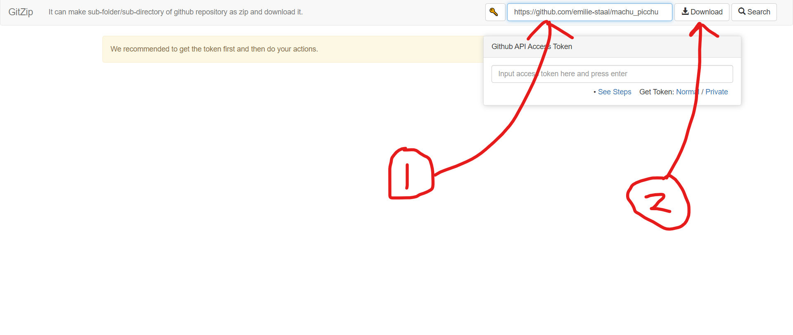

# Machu Picchu Photos
Hey guys, sorry for the wait, but here are all the pictures from the Inca Trail and Rainbow Mountain :smile:. If you're not familiar with Github, please follow the instruction below. I recommend downloading the entire repository, that way you can scroll through all the pictures own your own computers, and choose which ones you want to keep. If you're really struggling with the instructions, try asking a more tech savy friend / family member :wink:.

## Downloading all photos
1. Copy the url of this website (click the search bar at the top of your browser, then do Ctrl+A, Ctrl+C) 
2. Click the following link, which should open another website in a new tab on your brower: <a href="http://kinolien.github.io/gitzip/" target="_blank">CLICK HERE</a> (It won't give you a virus, I promise)
3. Click in the top right corner of the webpage, and paste the url you copied earlier (Ctrl+V), then click the download button (see pic below)
    
4. You should now have a .zip file containing all the pictures from the repository in your Downloads. From here, just double click it and you should be able to find all the pictures :smile: